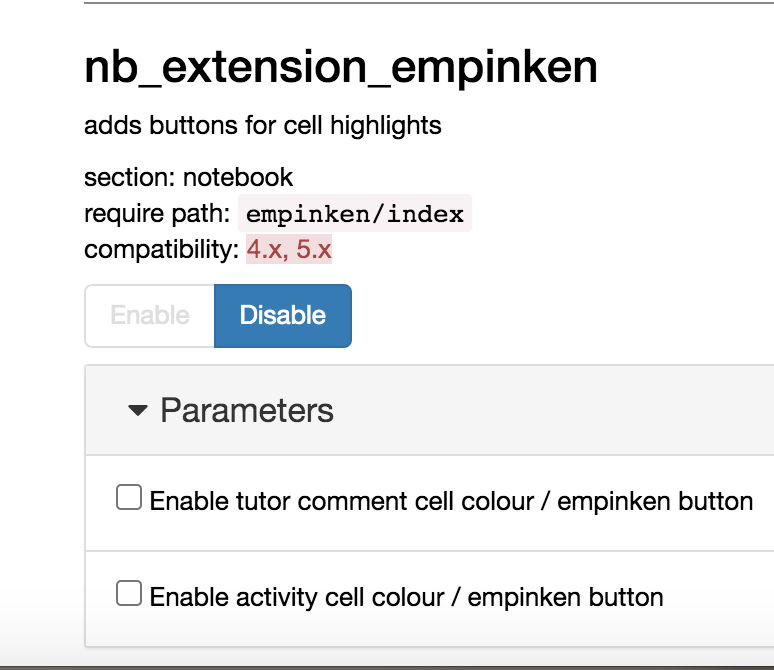

# nb_extension_empinken
Jupyter notebook extension for background colouring selected cells.

[](https://mybinder.org/v2/gh/innovationOUtside/nb_extension_empinken/master)

Install the latest version from the defaul branch in this repository:

`pip install --upgrade git+https://github.com/innovationOUtside/nb_extension_empinken.git`

Or from a particular branch (eg te `tags` branch):

`pip install --upgrade git+https://github.com/innovationOUtside/nb_extension_empinken.git@tags`

Install a released version from PyPi:

`pip install nb-extension-empinken`

The extension should be automatically installed and enabled.

If you need to do things manually:


```
jupyter nbextension uninstall empinken
jupyter nbextension install empinken --user
jupyter nbextension enable empinken/index
```


Three buttons are provided that toggle the colour of selected code or markdown cells:

- activity cells (blue);
- student annotation cells (yellow);
- tutor feedback cells (pink).


Not enabled yet, at some point there should be `nbconfigurator` settings that allow you to select which buttons are displayed on the toolbar.




## History

Originally developed in support the OU distance education course *TM351 Data Management and Analysis*, the extension provides toolbar buttoms that highlight selected cells with particular background colours.

The extension broke after a year or two of use, but I've tried to patch it up again.

The original use case allowed course material authors to style activity related cells with a blue colour theme, matching the convention used in online VLE materials.

A pink colour was used in production by the course team to highlight prodcution related course team discussions in notebooks, or cells that contained errors.

The pink colouring button was used by tutors during course presentation (i.e. in support of direct teaching) to colour feedback cells they had added to students' marked work. Somewhere along the line, the feature came to be known as "empinken"... 

The updated version of the extension also includes a yellow cell highlight, that I think can be used in at least two ways:

- firstly, as an activity prompt to students in provided materials that they need to write something in the notebook as part of the activity;
- secondly, as a way for students to highlight cells that they have added to the notebook to distinguish them from content that came with the original notebook.


## TO DO

It would probably also make sense to allow users to set colours, which would give me an excuse to learn how to use a colour picker widget.

It strikes me that the extension could be generalised to allow notebook cell tags to be used to identify cells that should be coloured in particular ways. So eg in configurator, associate the tag "activity" with a selected blue etc.

Maybe also consider a setting that would colour all student created cells yellow (or whatever) by hooking something on to the notebook's cell add button? 
